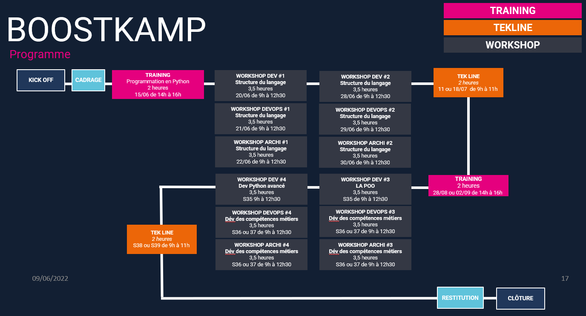

# Formation Python BNC

Juin/Septembre 2022

_


---
# Sommaire

* Le calendrier de la formation
* Le contenu de cette formation
* Le programme du jour

---
## Le calendrier de la formation



---
## Le contenu de la formation

3 chapîtres sont définis:

+ Les structures de base du langage.
+ La programmation `objet`.
+ Le développement avancé.

**A noter:** Les principales bibliothèques internes seront utilisées à travers les exercices.

Tous les documents, exemples et exercices sont accessibles [here](https://github.com/YvesDup/FormationPython/tree/main/Kampus/Documents%26Exemples)

---
### Les structures de base du langage (WS1&2).

* Les types de données simples.
* Les types évolués: listes, tuples, dictionnaires et ensembles.
* Les branchements conditionnels et les boucles.
* Les fonctions en Python.
* La documentation.
* La structure d'un script Python.
* Les notations en compréhension.
* La gestion des bibliothèques externes.

---
### La programmation `objet` (WS3).
* Rappel sur le modèle objet : classe, objet, attribut, méthode. 
* Les constructeurs et destructeurs.
* Le paramètre `self`.
* Les noms et fonctions internes des classes et objets.
* Les méthodes magiques, fonctionnelles.
* La visibilité des attributs et méthodes: public, privée.
* Attributs et méthodes de classe.
* Les mécanismes d'héritage.

---
### Le développement avancé (WS4).
* Les bonnes pratiques.
* La gestion des erreurs.
* Les environnements virtuels.
* L’unpacking et l’opérateur `splat`.
* Les fonctions internes `map`, `filter`, `zip`.
* Les itérateurs, les générateurs.
* Les bibliothèques `collections`, `itertools` et `functools`.
* L’utilisation de décorateurs.
* L’utilisation de gestionnaire de contexte.

---
## Le programme du jour (début du chapître 1).

* Présentation du langage Python
* Langage interprété vs Langage compilé.
* Typage dynamique, typage fort, le `duck typing`.
* La structuration d'un programme en Python.
* L'interpréteur Python.
* Exploration des types en Python.
* Introduction aux fonctions.

---
### Présentation du langage Python
<style scoped> {
  font-size: 28px;
}
</style>

Le langage Python est un langage interprété, procédural et objet. Il est multi-plateforme et a été développé par Guido Van Rossum.

Le début du développement commence à la fin des années 1980 (le dernier millénaire)

+ v1 en fév 1992.
+ v2 en octobre 2000, la v2.7 est la dernière.
+ v3 en décembre 2008.

Depuis la v3.9, publication annuelle d'une nouvelle version: la v3.11 est programmée pour le 3 octobre 2022.

[Python sur wikipedia](https://fr.wikipedia.org/wiki/Python_(langage))

---
### Langage interprété vs Langage compilé.
<style scoped> {
  font-size: 30px;
}
</style>
+ langage compilé:
  + il existe plusieurs phases pour construire son programme.
  + le programme est lancé par le système d'exploitation.

+ langage interprété:
  + le fichier source non transformé est exécuté au fur et à mesure de la lecture des instructions par un programme: l'interpréteur.

En Python, il existe un mécanisme de transformation en 'bytecode' d'un source Python. C'est ce 'bytecode' qui est exécuté par l'interpréteur.

**Note:** La bibliothèque interne [`dis`](https://docs.python.org/fr/3.9/library/dis.html) de Python permet de voir le 'bytecode' produit.

---
### Typage dynamique, typage fort, le `duck typing`
<style scoped> {
  font-size: 30px;
}
</style>
+ Chaque variable en Python devient typée dynamiquement lors de l'affectation. Par exemple:
```py
a = 10 # a est un entier
print(type(a)) # <type 'int'>
a = 'string' # a est maintenant une chaine
print(type(a)) # <type 'str'>
a += 10 # TypeError: cannot concatenate 'str' and 'int' objects
a = None
```
+ Le typage fort permet de contrôler les opérations sur les variables.
+ "Ce n'est pas ce que tu es qui m'importe, c'est ce que tu peux faire". Une variable, un objet peut être parcourable, appelable comme une fonction, sérialisable ou 'indiçable'. Voici le principe du [`duck typing`](https://fr.wikipedia.org/wiki/Duck_typing).


---
### L'interpréteur Python
<style scoped> {
  font-size: 32px;
}
</style>
Après installation de [Python](www.python.org) sur le poste de travail, dans un terminal, lancement de l'interpreteur Python:
```zsh
yves@MacBook-Pro-de-yves cpython % python3
Python 3.10.1 (v3.10.1:2cd268a3a9, Dec  6 2021, 14:28:59) [Clang 13.0.0 (clang-1300.0.29.3)] on darwin
Type "help", "copyright", "credits" or "license" for more information.
>>> exit() or Ctrl+D, to quit
```

La commande `python3 hello.py Guido` exécute le script `hello.py` et passe la valeur 'Guido' comme paramètre au script

```zsh
yves@MacBook-Pro-de-yves cpython % python3 hello.py Guido
"Hello -Guido- !!!"
yves@MacBook-Pro-de-yves cpython %
```
---
<style scoped> {
  font-size: 29px;
}
</style>
Afficher la version de Python

```zsh
yves@MacBook-Pro-de-yves cpython % python3 -V
Python 3.10.1
yves@MacBook-Pro-de-yves cpython %
```

Afficher le dossier courant

```zsh
python3 -c 'import os; print(os.getcwd())'
/Users/yves/Documents/_Jobs/_Clients/cpython/cpython
yves@MacBook-Pro-de-yves cpython %
```

Lancer le module `cProfile` sur un script Python `model.py`, vers un fichier resultat avec l'option `-o result.cprof`.

```zsh
python3 -m cProfile model.py
yves@MacBook-Pro-de-yves cpython %
```

---
### Structure d'un script Python

Pour chaque script python, on distingue 3 parties, dans cet ordre :
* les `import` de bibliothèques, les constantes `SIZE=10` et les variables globales `items = []`.
* les fonctions `def xxx(): ...`, les classes `class Obj: ...`.
* le point d'entrée principal du script `__name__ == '__main__'`.

**Note**: tout fichier script en Python est candidat pour être passé à l'interpréteur, ou pour être utilisé comme une bibliothèque locale via l'instruction `import`.

---
### Exploration des types en Python
<style scoped> {
  font-size: 22 px;
}
</style>

|Types simples | Exemples |
|-------|----|
|nombres entiers| 10, 10_000_000|
|booléens| True, False |
|nombres à virgule| -3.14, 1.21e-19|
|nombres complexes| 2j + 9|
|chaines de caractères|'Hello', "world", """\thep\ntoi!!"""|
|tableau d'octets| bytearray('hello'), |
|valeur nulle| None |

---
.
Types composés | Exemples|
|-------|----|
| listes  | [], [10, True, "string", 1.22]|
| tuples | ("un",),  (10, True, "string", 1.22)|
| ensembles | {10, "20", 30.0},  {(1,"un), 'I'}|
|dictionnaires| {"dix":10, 20:"XX"}|
| ensembles gelés | frozenset({1, 2, 3})} |
---
<style scoped> {
  font-size: 22 px;
}
</style>

Types avancés | Exemples|
|-------|----|
| fonctions, méthodes| def f(a, b, c): pass, lambda x: x+1 |
|range| range(10), range(1, 20, 3)|
|générateurs| fonction avec instruction `yield`, forme en compréhension|
|itérateurs| it = iter(list), it = map(lambda x: x**2 ,nums) |
|object de base| object()|

Pour chaque type en Python, la notion de mutabilité et d'immutabilité sera examinée (appronfondie pendant les WS).

---
### Exploration des types en Python (suite)
<style scoped> {
  font-size: 29px;
}
</style>
Classification des types composés/avancés

|Type de données | Questions/Actions sur les éléments  |   Exemples  |
|--------| ------- | -------|
| conteneurs | existe, parcourable | générateur, itérateur|
|||
| collections | combien | ensemble, ensemble gelé  |
|||
| **séquences**| accessible directement, inversable, triable* | liste, tuple, str, bytearray|
|||
| **tableaux associatifs** | accessible directement | dictionnaire|


---
### Structuration conditionnelle et répétition
<style scoped> {
  font-size: 28px;
}
</style>

#### Les blocs
La notion de bloc en Python est toujours rattachée à des instructions ou des définitions. Le bloc démarre dès le symbole `:`. Les instructions du bloc seront positionnées avec le même retrait (4 espaces). Les instructions concernées sont: 
+ if, elif, else,
+ for, while,
+ with

```py
if x == 0: #--- début de bloc
    x += 1
    y = -y
#--- fin de bloc
d = ...
```

---
<style scoped> {
  font-size: 28px;
}
</style>

Les définitions sont:
+ fonctions ou méthodes
+ générateurs
+ classes

```py
def somme_des_opposes(a, b ,c): #-- debut de bloc
    """Ceci est une docstring
    """
    tout = a + b + c
    return -tout
#--- fin de bloc
x = somme_des_opposes(10, 2, -5)
```

Naturellement dans une fonction ou une méthode, des instructions comme celles citées dans l'exemple précédent contiennent leur propre bloc.

---
<style scoped> {
  font-size: 28px;
}
</style>
#### Portée des variables dans un bloc.

En python, une variable définie dans un bloc est disponible aussi pour le bloc englobant. Par exemple:
```py
  if retour:
    c = None
    if a == 10:
        b = a + 5
        c = fff(b)
    print(b, c) # risqué, non ?
```

---
#### Les structures conditionnelles
<style scoped> {
  font-size: 28px;
}
</style>
```py
if <condition>:
  pass
elif <autre_condition1>:
  pass
elif <autre_condition2>:
  pass
else:
  pass
```
**A noter:** 
+ il n'y a pas d'instruction "switch' en python. Il existe un opérateur ternaire: `a = 10 if x > 10 else -10`
+ les opérateurs logiques dans les conditions sont: `and`, `or`et `not`.
+ les opérateurs de comparaison sont classiques, le `in`a été rajouté.

---
#### Les répétitions
<style scoped> {
  font-size: 28px;
}
</style>
Il existe 2 types de boucles en langage Python

+ Le `for`:
  ```py
  for item in (10, 20, 'Hello'):
      print(item)
  ```
+ Le `while`:
  ```py
  a = 10
  while a >= 0:
    print(a**2)
    a -= 1
  ```

  Les instructions `break`et `continue` existent en Python.

---
### Introduction aux fonctions
<style scoped> {
  font-size: 28px;
}
</style>
#### Définiition de la fonction
Un premier exemple de fonction:

```py
def fct1(a, b):
  """Documentation de la fonction fct1
  """
  return a * b

help(fct1)

Help on function fct1 in module __main__:

fct1(a, b)
    Documentation de la fonction fct1
```

---
<style scoped> {
  font-size: 27px;
}
</style>
Exécution de la fonction `fct1``
```py
fct1(10, 3)
fct1(3.5, 2)
fct1("test", 3)
fct1([1, 2, 3], 2)
fct1((1,2), 1000)
fct1(2j+3, 6)

fct1("z", "z") # provoque une erreur
fct1(1, 2, 4)  # provoque une erreur
```
Ici on remarque que: 
* Pas de contrôle de type en entrée de la fonction. Ce qui nous importe c'est que le premier argument soit d'un type 'multipliable'.
* La valeur retournée est toujours du type du premier argument

**Note:** Une fonction qui ne contient aucun `return`renvoie `None`

---
#### Fonctions internes pour le travail sur les types:
<style scoped> {
  font-size: 27px;
}
</style>
* `type(variable)`: type(1), type(None)
* `isinstance(variable, type | énumaration de type)`: isinstance(12.4, float), 
isinstance(x, (int, float))
* `issubclass(type, autre type)`: issubclass(bool, int)

Comment contrôler les types sur les paramètres ?

```py
def xxxx(arg1, arg2):
  """exemple de contrôle
  """
  if not isinstance(arg2, int):
    return "ERRRRRROR" 
  ...
```
