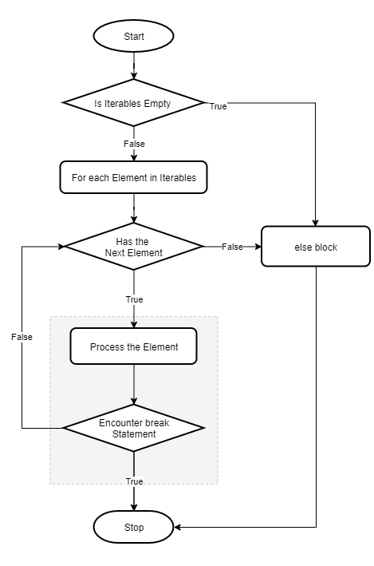

# Formation Python - 

Juin/Septembre 2022

_


---

# Workshopdev #1

Voici les thèmes abordés:

* les branchements conditionnels et boucles.
* les fonctions.

---
<style scoped> {
  font-size: 27px;
}
</style>
## Les branchements conditionnels et boucles

Il s'agit ici d'aborder les instructions Python qui permettent de mettre en place les alternatives et les boucles. 

Ces 2 types d'instructions sont natives dans tous les langages de programmation. A noter, que l'instruction de branchement sans condition `goto` n'existe pas en Python. Donc il n'y a pas de notion d'étiquette dans ce langage. 

```py
import keyword

print(f'{keyword.iskeyword("for") = }')
print(f'{keyword.kwlist = }')
 # -> keyword.kwlist = ['False', 'None', 'True', 'and', 'as', 'assert', 'async', 'await', 'break', 'class',
 # 'continue', 'def', 'del', 'elif', 'else', 'except', 'finally', 'for', 'from', 'global', 'if', 'import', 
 # 'in', 'is', 'lambda', 'nonlocal', 'not', 'or', 'pass', 'raise', 'return', 'try', 'while', 'with', 'yield']

```
Attention, la liste des mots-clés n'est pas constituée uniquement par des instructions.

---
### Les branchements conditionnels
<style scoped> {
  font-size: 25px;
}
</style>
```py
if a > 10 :
  pass
elif a >= 5 and 1 == True:
  ...
elif a // 3 == 0 or a  :
  pass
else:
  print("else ....")
```
**A noter:** 
* il n'y a pas d'instruction '__switch__' en Python. Cependant depuis la version `3.10` une instruction `match <exp>: case` a été mise en place.
* Il existe un opérateur ternaire: `a = x*10 if x > 10 else -1`.
* les opérateurs logiques dans les conditions sont: `and`, `or` et `not`.
* les opérateurs de comparaison sont standards, le `in` et le `is` ont été rajoutés.
* la notation suivante est possible et acceptée: `0 <= x <= 10`.

---
### Les répétitions
<style scoped> {
  font-size: 27px;
}
</style>
Il existe 2 types de boucles en langage Python:

+ l'instruction `for`: qui s'applique sur tous les objects parcourables ou itérables comme:
  + str, bytes, bytearray,
  + liste, tuple, dict, set,
  + itérateur, générateur.

  ```py
  for item in (10, 20, 'Hello'):
      print(item)
  print(item) # défini dans le bloc du `for`
  ```
Chaque objet parcourable possède une méthode interne `__iter__` qui renvoie un itérateur sur l'objet. Il suffit donc de vérifier que cette méthode est présente.

---
<style scoped> {
  font-size: 27px;
}
</style>
#### Mécanisme d'itération

Ce mécanisme fonctionne en 2 étapes:

1. récupérer un itérateur sur l'objet en appelant la fonction *interne (native)* nommé `iter(<object>)`. 
1. Ensuite on peut récupérer les éléments un par un via l'itérateur en appelant la fonction interne `next(<iterateur>)`. Quand il n'y a plus d'élément, une erreur apparaît. Un itérateur est utilisable une et une seule fois.

```py
l = [20, "Hello", True]
it = iter(l)
print(it)
print(next(it)) # -> 20
print(next(it)) # -> 'Hello'
print(next(it)) # -> True
print(next(it)) # -> renvoie une erreur `StopIteration`

```
---
<style scoped> {
  font-size: 27px;
}
</style>

+ l'instruction `while`:
  ```py
  a = 10
  while a >= 0:
    print(a**2)
    a -= 1
  ```

+ les instructions `break`et `continue` existent en Python.
  + le `break` interrompt la boucle. Si il y a plusieurs boucles imbriquées, cette instruction interrompt la boucle courante.
  + le `continue` interrompt le traitement dans la boucle et retourne sur l'instruction `for`ou `while`.

+ il existe une clause `else` pour `for`et `while`

---
<style scoped> {
  font-size: 27px;
}
</style>
La clause `else` des boucles

| `for` | `while` | Commentaires |
|--------|----|---|
|  | | Si la boucle est complètement exécutée, alors le bloc du `else` est exécutée. Si un `break` est rencontré, pas d'exécution de ce bloc `else`|
|||


---
<style scoped> {
  font-size: 26px;
}
</style>
## Les fonctions

les fonctions constituent un enchainement d'instructions avec des données en entrée et produisent un résultat qui peut être réutilisé.

+ données en entrée sont des paramètres ou arguments.
+ données en sortie sont les valeurs retournées.

Une fonction doit être définie pour ensuite être exécutée.

```py
# definition de la fonction avec le mot-clé `def`
def exemple(a, b, c):
    """Ceci est une définition
    """
    a = (a+b)/c
    return a, a-1 

# exécution de la fonction avec passage de paramètres et récupération du resultat dans la variable `ret`.
ret = exemple(10, 20, 5)
```
---
### Les arguments

Les arguments permettent un lien entre la fonction appelante et la fonction appelée.

* Les arguments indiqués dans la definition de la fonction sont appelés les **paramètres formels**. 
* Les arguments passés à la fonction appelée sont appelées paramètres effectifs. Ceux sont souvent des variables de la fonction appelante, ou des parmètres formels de la fonction en courante.

---
<style scoped> {
  font-size: 25px;
}
</style>
### Arguments positionnels

Cela correspond aux arguments obligatoires de la fonction

```py
def calcul(a, b ,c):
    """
    """
    return (a * b) // c

def test_calcul():
    """
    """
    print(calcul(1, 2, 3))

    try:
        calcul(1, 2)
    except Exception as e:
        print(e)
    try:
        a = 1
        calcul(a, a, a, a)
    except Exception as e:
        print(e)
```

---
<style scoped> {
  font-size: 28px;
}
</style>
```py
def test_calcul_suite():

    y = calcul(2, 7.89, True)
    print(y)

    try:
        calcul([5, True, None], [10], True)
    except Exception as e:
        print(e)

    z = calcul(c=10, a=5, b=8)
    print(z)
```
Dans ce dernier exemple, les arguments peuvent être passés avec le nom des paramètres formels, cad ceux de la définition de la fonction. Dans ce cas, le nom doit être indiqué pour tous.

---
<style scoped> {
  font-size: 25px;
}
</style>
### Aguments avec valeurs par defaut

Il est possible de spécifier un paramètre formel (au niveau de la définition de la fonction) ayant une valeur par défaut.
Si ce paramètre est omis lors de l'appel à cette fonction alors ce paramètre prendra comme valeur la valeur défaut indiquée. Ces paramètres sont aussi appelés paramètres **optionnels**.

Les paramètres avec des valeurs défaut sont toujours positionnés en dernier dans la liste des paramètres formels.

```py
def format_heure(h, m, s):
    """
    Le paramètre avec des valeurs default
    Ici sep avec la valeur ":"
    """
    # format attendu "HHsepMMsepSS" 
    return "{0:02d}:{1:02d}:{2:02d}".format(h, m, s)

print(format_heure(16, 8, 45)) # -> 16:08:45
print(format_heure(16, 8, 7)) # -> 16:08:07
```

---
<style scoped> {
  font-size: 28px;
}
</style>
Voici la même fonction avec un paramètre supplémentaire pour la gestion du séparateur. Si le séparateur en omis à l'exécution, alors le séparateur prendra comme valeur `":"`.

```py
# ici je veux choisir le format
def format_heure_sep(h, m, s, sep=":"):
    """Le paramètre avec des valeurs default
    Ici sep avec la valeur ":" """

    # format attendu "HHsepMMsepSS" 
    return "{0:02d}{3}{1:02d}{3}{2:02d}".format(h, m, s, sep)


# ici sep n'est pas indiqué donc il prend la valeur ':'
print(format_heure_sep(16, 8, 45)) # -> 16:08:45

# ici sep vaut '-'
print(format_heure_sep(16, 8, 7, "-")) # -> 16-08-07
```
---
<style scoped> {
  font-size: 28px;
}
</style>
Précisions sur les paramètres optionnels
```py
# cas de plusieurs valeurs paramétres avec des valeurs par défaut
def param_def(a, b=10, c=-1):
    print(f'{a = }, {b = }, {c = }')

param_def(10) # b <- 10, c <- -1
param_def(10, b=7) # b <- 7, c <- -1
param_def(10, c=0) # b <- 10, c <-0 
param_def(10, c=0, b=0) # b <- 10, c <-0 
```

---
### Particularités sur les fonctions

Dans le cadre des définitions de fonctions, ou de leurs appels, plusieurs expressions avec `*` sont possibles

#### Liste variable d'arguments

Une fonction qui prend une liste variable d'arguments comme le `printf` en langage C

```python
def product(val, *args):
    '''
    Ici args est un tuple qui va contenir 0 ou N valeurs
    '''
    for arg in args:
        val *= arg

    return val

# product peut s'utiliser comme ceci
product(10) # args est vide
product(10, 20, 30, 40)  # ici args = (20, 30, 40)
product('tti', 20) # ici args = (20,)
product(10, 20, 30, val1=4)  # provoque une erreur
```

Il est aussi possible d'avoir un paramètre avec valeur par defaut dans ce genre de passage de paramètre,
voir l'exemple qui suit:

```python
def concat(*args, sep=';'):
    return sep.join(map(str, args))

print(concat(1, 2, 3))
print(concat("A", "B", sep='+'))
```


#### Arguments nommés

Une fonction en Python peut être appelée avec des arguments nommés (keyword arguments)
qui ne sont pas ceux de la définition. Dans ce cas, ces paramètres sont récupérés dans un dictionnaire avec la syntaxe `**`

```python
def sample_kwargs(val1, val2, **kwargs):
    '''
    '''
    if 'show_kwargs' in kwargs:
        for k, v in kwargs.items():
            print(k, '->', v)

    if 'debug' in kwargs:
        print(val1, val2, val1+val2)

    return val1 + val2

# peut s'utiliser comme suit:
sample_kwargs(10, 20, debug=True)
# sans le nommage 'debug'
try:
    sample_kwargs(10, 20, True)
except Exception as e:
    print(e)
sample_kwargs(10, 20, sample=10)
sample_kwargs(val2='uuuu', val1='+toto', show_kwargs=True)
sample_kwargs(val1=10, val2=10_000)

```


### Paramètres spéciaux

Depuis la documentation Python sur <https://docs.python.org/fr/3/tutorial/controlflow.html#special-parameters>

```python

def f(pos1, pos2, /, pos_or_kwd, *, kwd1, kwd2):
#     -----------    ----------     ----------
#       |             |                  |
#       |        Positional or keyword   |
#       |                                - Keyword only
#        -- Positional only
```

où / et * sont facultatifs. S'ils sont utilisés, ces symboles indiquent par quel type de paramètre un argument peut être transmis à la fonction : position seule, position ou nommé, et seulement nommé. Les paramètres par mot-clé sont aussi appelés paramètres nommés.

Par exemple, écrire une fonction utilisable que par arguments nommés serait:

```python

def test_kwargs_only(*, a, b):
    '''
    '''
    print(a,b)

try:
    test_kwargs_only(10, b=20)
except Exception as e:
    print(e)
test_kwargs_only(b=10, a=5)
test_kwargs_only(a=2, b=50)
```

```python
def test_positional_only(a, b, /):
    '''
    '''
    print(a, b)

test_positionnal_only(10, 20)
try:
    test_positionnal_only(a=10, b=20)
except Exception as e:
    print(e)

```

## les valeurs retournées

En python, toute fonction peut retourner plusieurs valeurs car elle renvoie un tuple
Une fonction qui ne fait aucun appel à `return`, elle renvoie `None`


